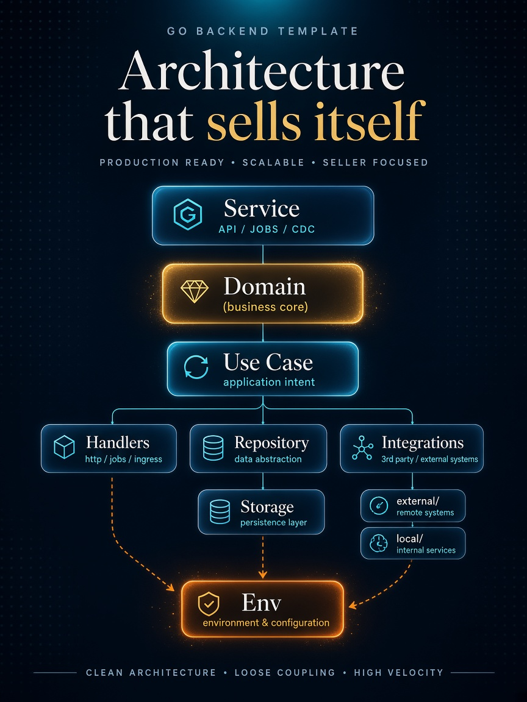

<p align="center">
  <h1 align="center">go-arch-template</h1>
  <p align="center">
    <b>Production-ready Go service template</b><br/>
    Clean Architecture · DDD · Ports & Adapters
  </p>
</p>

<p align="center">
  <a href="https://go.dev/"></a>
  <a href="LICENSE"></a>
  <a href="https://github.com/gonnafaraway/go-arch-template/stargazers"></a>
  <a href="https://github.com/gonnafaraway/go-arch-template/network/members"></a>
  <a href="https://github.com/gonnafaraway/go-arch-template/issues"></a>
</p>

<p align="center">
  <a href="#quick-start">Quick Start</a> ·
  <a href="#architecture">Architecture</a> ·
  <a href="#data-patterns">Data Patterns</a> ·
  <a href="#contributing">Contributing</a>
</p>

<p align="center">
  
</p>

---

## What is go-arch-template?

A starter kit for building Go services with **Clean Architecture** (Hexagonal / Ports & Adapters) and **Domain-Driven Design**. Layers stay separated, dependencies point inward, and swapping storage or transport does not touch business logic.

Use it when you want a service skeleton that already wires HTTP, repositories, use cases, observability, and OpenAPI — not a toy demo.

---

## Table of Contents

- [Key Features](#key-features)
- [Quick Start](#quick-start)
- [Architecture](#architecture)
- [Data Flow](#data-flow)
- [Observability & Storage](#observability--storage)
- [Data Patterns](#data-patterns)
- [Project Layout](#project-layout)
- [Contributing](#contributing)
- [License](#license)

---

## Key Features

- **Clean Architecture** — domain at the core; adapters only at the edges
- **DDD-ready domain** — entities, validators, and domain errors without framework imports
- **Use-case orchestration** — one business operation per use case, injected via interfaces
- **Pluggable repositories** — PostgreSQL, MongoDB, and mocks behind the same contracts
- **Multi-transport** — HTTP (with middleware), gRPC, and RPC stubs
- **OpenAPI / Swagger** — generated from annotations via `make swagger`
- **Integrations edge** — storage, external APIs, OAuth, and observability behind one anti-corruption layer
- **Background services** — API, jobs, and CDC controlled from one composition root

---

## Quick Start

### Requirements

- Go **1.27+**
- Make (optional, for OpenAPI targets)

### Clone and run

```bash
git clone https://github.com/gonnafaraway/go-arch-template.git
cd go-arch-template

go mod download
go run ./cmd/api
```

### Generate OpenAPI docs

```bash
make swagger
```

Specs land in `docs/api/openapi/` (`swagger.json`, `swagger.yaml`, `docs.go`).

---

## Architecture

Dependencies always point **inward**. Outer layers know about inner ones; the domain never imports adapters.

There is **no separate Infrastructure layer** in the mental model — storage clients, external APIs, OAuth, and observability all sit under **Integrations** (anti-corruption edge).

| Layer | Path | Role |
| --- | --- | --- |
| **Service** | `internal/api/service/` | Long-running API, jobs, CDC lifecycle |
| **Domain** | `internal/api/domain/` | Entities, business rules, domain errors |
| **Use Case** | `internal/api/usecase/` | Application workflows and orchestration |
| **Handlers** | `internal/api/handlers/` | Thin controllers: request → use case → response |
| **Repository** | `internal/api/repository/` | Persistence ports + Postgres / Mongo / mock impls |
| **Storage** | `internal/api/storage/` | DB / cache / queue / object-storage clients |
| **Env** | `internal/api/env/` | Shared config used by Storage, Handlers, Integrations |
| **Integrations** | `internal/api/integration/` | Outbound edge: `external/` + `local/` (`client.go` / `errors.go` / `models.go`) |
| **App** | `internal/api/app/` | Composition root and DI wiring |

### Patterns in play

Repository · Factory · Strategy · Adapter · Dependency Injection · Middleware · Use Case / Command · DTO · Anti-Corruption Layer

### Principles

- **Clean Architecture** — dependency rule
- **SOLID** — especially interface segregation and dependency inversion
- **DDD** — rich models, domain validation, ubiquitous language
- **Separation of concerns** — clear boundaries between layers

---

## Data Flow

```text
HTTP Request
    → Transport (middleware: log, metrics, tracing, Sentry)
    → Handler (validate + map request)
    → Use Case (orchestrate)
    → Domain (rules & invariants)
    → Repository (port)
    → Integrations (Postgres / Mongo / billing / …)
    → DTO / response back to client
```

---

## Observability & Storage

Both live on the **Integrations** edge — swap implementations without touching use cases or domain.

| Concern | Stack |
| --- | --- |
| Logging | Zap |
| Tracing | OpenTelemetry (OTLP) |
| Metrics | Prometheus |
| Errors | Sentry |
| Storage | PostgreSQL · MongoDB · Redis · Kafka · S3 · Nexus |

---

## Data Patterns

How models move through the stack without mixing responsibilities.

### 1. Entity (domain model)

Business concept with invariants. Lives in `domain`, no DB/HTTP imports.

```go
package domain

import "errors"

type User struct {
    ID    string
    Name  string
    Email string
}

func NewUser(name, email string) (*User, error) {
    if name == "" {
        return nil, errors.New("name is required")
    }
    return &User{Name: name, Email: email}, nil
}
```

### 2. Value Object

Immutable, compared by value (`Email`, `Money`, `Address`).

```go
package domain

import (
    "errors"
    "strings"
)

type Email struct {
    value string
}

func NewEmail(value string) (*Email, error) {
    if !strings.Contains(value, "@") {
        return nil, errors.New("invalid email format")
    }
    return &Email{value: value}, nil
}

func (e Email) Value() string { return e.value }
```

### 3. DTO

Transport-facing shapes for API in/out. No business methods.

```go
package transport

type UserResponse struct {
    ID   string `json:"id"`
    Name string `json:"name"`
}
```

### 4. Data Mapper

Converts domain ↔ persistence without leaking storage into the domain.

```go
package adapters

import "your-app/domain"

type UserMapper struct{}

func (m UserMapper) ToDB(user *domain.User) map[string]interface{} {
    return map[string]interface{}{
        "id": user.ID, "name": user.Name, "email": user.Email,
    }
}

func (m UserMapper) FromDB(row map[string]interface{}) *domain.User {
    return &domain.User{
        ID: row["id"].(string), Name: row["name"].(string), Email: row["email"].(string),
    }
}
```

### 5. Repository

Persistence port used by use cases.

```go
package repository

import "your-app/domain"

type UserRepository interface {
    Create(user *domain.User) error
    FindByID(id string) (*domain.User, error)
    Update(user *domain.User) error
    Delete(id string) error
}
```

### Request path (end to end)

1. HTTP → DTO (transport)
2. DTO → domain entity (adapters)
3. Use case runs on the entity
4. Repository + mapper persist
5. Entity → response DTO → JSON

### Best practices

- Keep domain pure — no adapter / integration imports
- Validate at the transport edge; enforce invariants in the domain
- Prefer immutable value objects
- Version DTOs when the public API evolves
- Separate DTO / Entity / Mapper responsibilities

---

## Project Layout

```text
go-arch-template/
├── cmd/api/                 # entrypoint
├── internal/api/
│   ├── app/                 # composition root
│   ├── domain/              # entities & domain validators
│   ├── usecase/             # application logic
│   ├── repository/          # ports + implementations
│   ├── integration/         # outbound edge (anti-corruption)
│   │   ├── external/        # billing, company, usersservice, prometheus, sentry
│   │   │   └── <name>/      # client.go · errors.go · models.go
│   │   └── local/           # log, oauth, trace
│   │       └── <name>/      # client.go · errors.go · models.go
│   ├── env/                 # shared config (Storage / Handlers / Integrations)
│   ├── transport/           # HTTP / gRPC / RPC
│   ├── handlers/            # HTTP controllers
│   ├── service/             # API / jobs / CDC
│   ├── storage/             # client factories
│   └── validator/           # shared validation
├── docs/api/openapi/        # Swagger artifacts
├── migrations/              # SQL migrations
├── build/                   # Docker & build scripts
├── Makefile
└── go.mod
```

---

## Contributing

PRs that improve quality, docs, integrations, or observability are welcome.

- Follow the layering and dependency rules above
- Prefer interfaces at boundaries; keep handlers thin
- Add mocks or tests when changing repository / use-case contracts
- Open an [issue](https://github.com/gonnafaraway/go-arch-template/issues) for larger design changes before a big PR

---

## License

Licensed under the [Apache License 2.0](LICENSE).

---

<p align="center">
  If this template saves you time, consider giving the repo a ⭐
</p>
